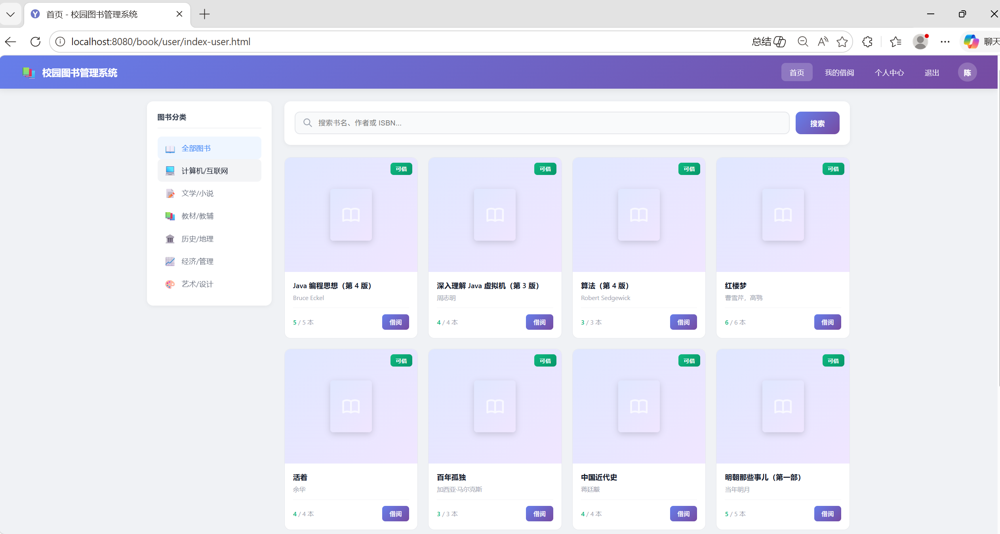
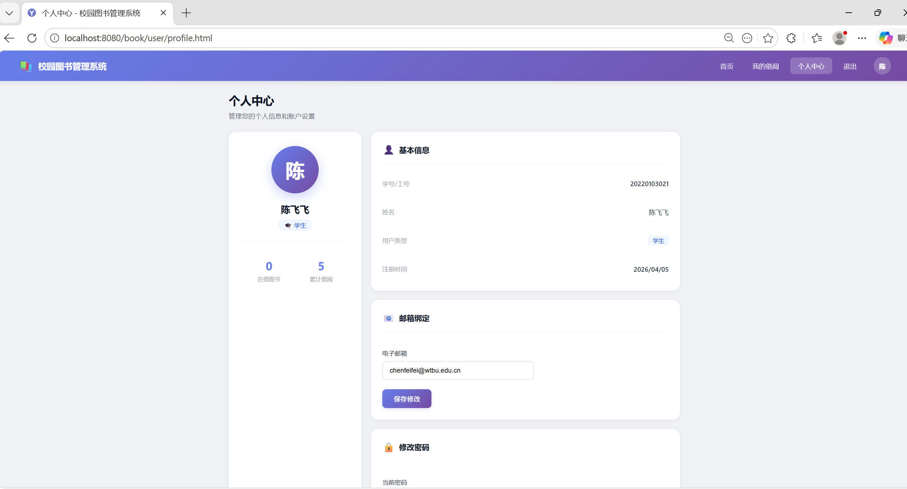
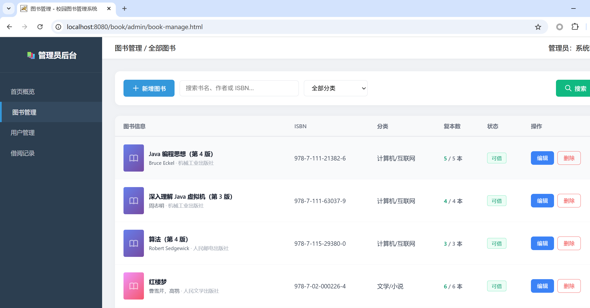
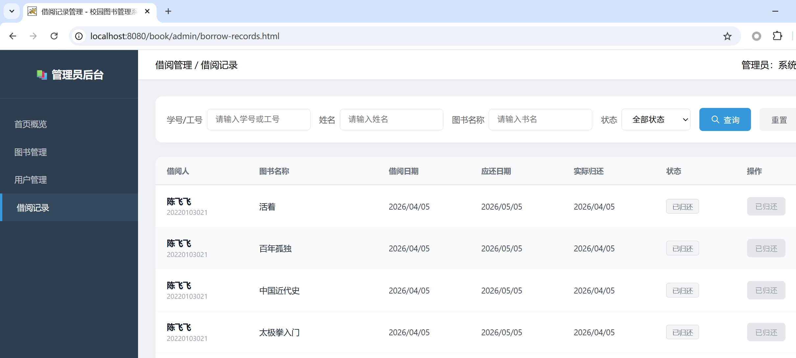

<div align="center">

# 校园图书管理系统

</div>

<div align="center">


一个基于 JavaWeb 技术的校园图书管理系统，支持用户借阅、管理员管理等功能。

</div>

---

## 📋 项目简介

校园图书管理系统是一个典型的信息管理系统，旨在为校园师生提供便捷的图书查询和借阅服务，同时为管理员提供高效的图书和用户管理功能。系统采用 B/S 架构，基于 Java Servlet 技术栈开发，支持多复本管理和完善的权限控制。

### ✨ 主要特性

- 🔐 **双角色权限**：普通用户和管理员两种角色，权限分离
- 📚 **多复本管理**：支持同一图书多个复本，动态计算可借数量
- 🔍 **智能搜索**：支持按书名、作者、ISBN 模糊搜索
- 📊 **分类筛选**：支持按图书分类快速筛选
- ⏰ **借阅期限**：30 天借阅期限，自动计算应还日期
- 🚫 **超期控制**：有超期未还记录时限制借阅新书
- 👥 **用户管理**：自动识别学生/教师身份，管理员统一管理
- 🛡️ **安全认证**：Session 认证 + MD5 密码加密

---

## 🛠️ 技术栈

### 后端技术
- **语言**: Java 17
- **框架**: Jakarta Servlet 6.1
- **数据库**: MySQL 8.0
- **连接池**: Alibaba Druid 1.2.20
- **JSON 处理**: Jackson 2.15.2
- **构建工具**: Maven 3.8+

### 前端技术
- HTML5 / CSS3 / JavaScript
- JSTL (Jakarta Server Pages Standard Tag Library)

### 开发环境
- **IDE**: IntelliJ IDEA / Eclipse
- **Web 服务器**: Apache Tomcat 11.0+
- **版本控制**: Git
- **API 测试**: Postman / 浏览器开发者工具

---

## 📦 项目结构

```
book/
├── src/main/
│   ├── java/edu/wtbu/cs/book/
│   │   ├── controller/          # Servlet 控制器层
│   │   │   ├── AuthServlet.java           # 认证（登录/注册/登出）
│   │   │   ├── UserServlet.java           # 用户个人中心
│   │   │   ├── BookServlet.java           # 图书浏览与查询
│   │   │   ├── BorrowServlet.java         # 借阅相关操作
│   │   │   ├── AdminBookServlet.java      # 管理员-图书管理
│   │   │   ├── AdminUserServlet.java      # 管理员-用户管理
│   │   │   └── AdminBorrowServlet.java    # 管理员-借阅管理
│   │   ├── service/             # 业务逻辑层
│   │   │   ├── UserService.java
│   │   │   ├── BookService.java
│   │   │   └── BorrowService.java
│   │   ├── dao/                 # 数据访问层
│   │   │   ├── UserDao.java
│   │   │   ├── BookDao.java
│   │   │   └── BorrowRecordDao.java
│   │   ├── entity/              # 实体类
│   │   │   ├── User.java
│   │   │   ├── Book.java
│   │   │   └── BorrowRecord.java
│   │   ├── filter/              # 过滤器
│   │   │   ├── LoginFilter.java         # 登录验证过滤器
│   │   │   └── AdminFilter.java         # 管理员权限过滤器
│   │   └── util/                # 工具类
│   │       ├── JDBCUtils.java           # 数据库连接工具
│   │       ├── MD5Utils.java            # MD5 加密工具
│   │       └── JsonUtils.java           # JSON 序列化工具
│   ├── resources/
│   │   └── druid.properties     # Druid 连接池配置
│   └── webapp/
│       ├── user/                # 用户端页面
│       │   ├── login.html               # 登录页
│       │   ├── register.html            # 注册页
│       │   ├── index-user.html          # 用户首页（图书列表）
│       │   ├── book_detail.html         # 图书详情
│       │   ├── my-borrowing.html        # 我的借阅
│       │   └── profile.html             # 个人中心
│       ├── admin/               # 管理员端页面
│       │   ├── admin-index.html         # 管理员首页
│       │   ├── book-manage.html         # 图书管理
│       │   ├── add-book.html            # 新增图书
│       │   ├── edit-book.html           # 编辑图书
│       │   ├── user-manage.html         # 用户管理
│       │   └── borrow-records.html      # 借阅管理
│       ├── js/
│       │   └── common.js                # 公共 JS
│       └── WEB-INF/
│           └── web.xml                  # Web 应用配置
├── doc/                         # 项目文档
│   ├── sql/                     # 数据库初始化脚本
│   │   └── book.sql
│   ├── UI/                      # 原型界面设计
│   ├── img/                     # 系统界面截图
│   └── 图书管理系统 - 项目说明文档.md
├── target/                      # Maven 构建输出目录
│   └── book.war                 # 打包后的 WAR 文件
├── pom.xml                      # Maven 配置文件
├── API.md                       # API 接口文档
└── README.md                    # 项目说明文档
```

### 📁 目录说明

| 目录 | 说明 |
|------|------|
| `controller/` | 处理 HTTP 请求，调用 Service 层 |
| `service/` | 业务逻辑实现，事务控制 |
| `dao/` | 数据库 CRUD 操作 |
| `entity/` | 与数据库表对应的 Java 对象 |
| `filter/` | 请求过滤器（登录验证、权限控制） |
| `util/` | 工具类（数据库连接、密码加密等） |
| `resources/` | 配置文件（Druid 连接池配置） |
| `webapp/` | Web 资源文件（HTML、JS、CSS） |
| `doc/` | 项目文档（原型设计、界面截图、数据库脚本、说明文档） |

---

## 🚀 快速开始

### 前置要求

- JDK 17 或更高版本
- Apache Tomcat 11.0+
- MySQL 8.0+
- Maven 3.8+

### 方式一：使用 IntelliJ IDEA 运行（推荐）

#### 1. 配置 Tomcat Server

1. 打开 IDEA，点击菜单栏 **Run** → **Edit Configurations...**
2. 点击 **+** 号，选择 **Tomcat Server** → **Local**
3. 配置以下参数：

   | 配置项 | 值 |
   |--------|-----|
   | **Name** | library_system（可自定义） |
   | **Tomcat server** | 选择已配置的 Tomcat 11.0+ |
   | **Context path** | `/book` ⚠️ **重要** |
   | **Server port** | `8080` |
   | **Admin port** | `8005` |

4. 点击 **Apply** → **OK** 保存配置

#### 2. 初始化数据库

```sql
CREATE DATABASE library_db CHARACTER SET utf8mb4 COLLATE utf8mb4_general_ci;
USE library_db;
```

执行 `doc/sql/book.sql` 文件初始化数据库：

```bash
mysql -u root -p library_db < doc/sql/book.sql
```

#### 3. 配置数据库连接

编辑 `src/main/resources/druid.properties` 文件：

```properties
driverClassName=com.mysql.cj.jdbc.Driver
url=jdbc:mysql://localhost:3306/library_db?useSSL=false&serverTimezone=Asia/Shanghai&characterEncoding=utf8
username=root
password=your_password
initialSize=5
maxActive=10
maxWait=3000
```

#### 4. 启动项目

点击 IDEA 工具栏的绿色运行按钮 ▶️ 启动项目

#### 5. 访问系统

打开浏览器访问：

- **用户端首页**: http://localhost:8080/book/user/index-user.html
- **管理员首页**: http://localhost:8080/book/admin/admin-index.html
- **登录页面**: http://localhost:8080/book/user/login.html

> ⚠️ **重要提示**: Context path 必须配置为 `/book`，与 `pom.xml` 中的 `<finalName>book</finalName>` 保持一致！

---

### 方式二：使用 Maven 打包部署

#### 1. 克隆项目

```bash
git clone https://gitee.com/your-username/lab2.git
cd lab2
```

#### 2. 创建数据库

```sql
CREATE DATABASE library_db CHARACTER SET utf8mb4 COLLATE utf8mb4_general_ci;
USE library_db;
```

执行 `doc/sql/book.sql` 文件初始化数据库表结构和示例数据：

```bash
mysql -u root -p library_db < doc/sql/book.sql
```

#### 3. 配置数据库连接

编辑 `src/main/resources/druid.properties` 文件：

```
# 数据库驱动
driverClassName=com.mysql.cj.jdbc.Driver
# 数据库URL
url=jdbc:mysql://localhost:3306/library_db?useSSL=false&serverTimezone=Asia/Shanghai&characterEncoding=utf8
# 数据库用户名
username=root
# 数据库密码
password=your_password
# 初始化连接数
initialSize=5
# 最大连接数
maxActive=10
# 最大等待时间
maxWait=3000
```

#### 4. 编译打包

```bash
mvn clean package
```

#### 5. 部署到 Tomcat

将生成的 `target/book.war` 文件复制到 Tomcat 的 `webapps` 目录：

```bash
# Linux/Mac
cp target/book.war $CATALINA_HOME/webapps/

# Windows
copy target\book.war %CATALINA_HOME%\webapps\
```

#### 6. 启动 Tomcat

```bash
# Linux/Mac
cd $CATALINA_HOME/bin
./startup.sh

# Windows
cd %CATALINA_HOME%\bin
startup.bat
```

#### 7. 访问系统

打开浏览器访问：

- **用户端首页**: http://localhost:8080/book/user/index-user.html
- **管理员首页**: http://localhost:8080/book/admin/admin-index.html
- **登录页面**: http://localhost:8080/book/user/login.html

---

## 👥 默认账号

### 管理员账号

| 用户名 | 密码 | 角色 |
|--------|------|------|
| admin | 123456 | 管理员 |

> ⚠️ **重要提示**: 首次登录后请立即修改管理员密码！

### 测试用户账号

系统中已预置多条测试图书数据，您可以注册新用户进行测试。

---

## 📖 功能说明

### 普通用户功能

#### 1. 用户认证
- ✅ 用户注册（学号/工号、姓名、密码、邮箱）
- ✅ 用户登录（自动识别学生/教师身份）
- ✅ 退出登录

#### 2. 个人中心
- ✅ 查看个人信息（学号/工号、姓名、用户类型、邮箱、注册时间）
- ✅ 修改密码
- ✅ 修改邮箱

#### 3. 图书浏览
- ✅ 图书列表展示（封面、书名、作者、出版社、简介）
- ✅ 按书名/作者/ISBN 模糊搜索
- ✅ 按分类筛选
- ✅ 查看图书详情（可借复本数/总复本数）

#### 4. 借阅管理
- ✅ 借阅图书（最多同时借阅 5 本，期限 30 天）
- ✅ 归还图书
- ✅ 查看当前借阅记录
- ✅ 查看历史借阅记录
- ✅ 检查借阅资格（是否达到上限、是否有超期记录）

### 管理员功能

#### 1. 图书管理
- ✅ 新增图书（设置复本数）
- ✅ 编辑图书信息
- ✅ 删除图书（无人借阅的图书才能删除）
- ✅ 图书列表管理
- ✅ 图书搜索

#### 2. 用户管理
- ✅ 查看所有注册用户
- ✅ 搜索用户（按学号/工号、姓名）
- ✅ 删除用户（有借阅在身的用户不能删除）
- ✅ 保护管理员账号不被删除

#### 3. 借阅管理
- ✅ 查看所有借阅记录
- ✅ 按条件搜索借阅记录（用户名、姓名、图书名、状态）
- ✅ 手动归还图书（管理员代还）
- ✅ 查看超期借阅记录
- ✅ 显示超期天数

---

## 📸 系统界面

### 用户端界面

#### 登录页面


#### 用户首页 - 图书列表


#### 我的借阅


#### 个人中心


### 管理员端界面

#### 管理员首页


#### 图书管理


#### 用户管理


#### 借阅记录

---

## 🔧 API 接口

系统采用 RESTful 风格的 API 设计，所有接口返回 JSON 格式数据。

### 接口模块

| 模块 | 路径 | 说明 |
|------|------|------|
| 认证模块 | `/api/auth` | 登录、注册、登出 |
| 用户模块 | `/api/user` | 个人信息、修改密码/邮箱 |
| 图书模块 | `/api/books` | 图书浏览、搜索、详情 |
| 借阅模块 | `/api/borrow` | 借阅、归还、借阅记录 |
| 管理员-图书 | `/api/admin/books` | 图书 CRUD |
| 管理员-用户 | `/api/admin/users` | 用户管理 |
| 管理员-借阅 | `/api/admin/borrows` | 借阅记录管理 |

详细的 API 文档请参考 [API.md](API.md)。

### 响应格式

**成功响应：**
```json
{
  "code": 200,
  "message": "操作成功",
  "data": { }
}
```

**错误响应：**
```json
{
  "code": 400,
  "message": "错误描述",
  "data": null
}
```

### 状态码说明

| 状态码 | 说明 |
|--------|------|
| 200 | 请求成功 |
| 400 | 请求参数错误 |
| 401 | 未登录或登录失效 |
| 403 | 无权限访问 |
| 404 | 资源不存在 |
| 500 | 服务器内部错误 |

---

## 🗄️ 数据库设计

### 数据表

系统包含三张核心数据表：

1. **users** - 用户表
   - 存储用户基本信息、角色、用户类型等

2. **books** - 图书表
   - 存储图书信息、复本数管理等

3. **borrow_records** - 借阅记录表
   - 存储借阅关系、借阅日期、归还状态等

详细的数据表结构请参考 [doc/图书管理系统 - 项目说明文档.md](doc/图书管理系统%20-%20项目说明文档.md) 中的附录 B。

---

## 📌 业务规则

### 借阅规则

- 每人最多同时借阅 **5 本**书（借阅中状态）
- 借阅期限为 **30 天**
- 只有当图书可借复本数 > 0 时才能借阅
- 借阅时：`available_copies--`
- 归还时：`available_copies++`

### 超期处理

- 超期判断：当前日期 > 应还日期 且 状态='borrowing'
- 有超期未还图书记录的用户，**不能借阅新书**
- 超期图书归还后，借阅限制解除
- 实现方式：在用户借阅时实时计算检查

### 删除限制

- 有借阅在身的用户不能删除（存在 status='borrowing' 的借阅记录）
- 有借阅记录的图书不能删除（`available_copies < total_copies`）
- 管理员账号不能删除

### 用户类型判断

系统根据学号/工号格式自动判断用户类型：

- **学生**：学号为 8-12 位纯数字
- **教师**：工号为 T 开头或 2-6 位数字
- **管理员**：role = 'admin'

---

## 🔒 安全特性

- ✅ **Session 认证**：使用 Session 进行用户身份验证
- ✅ **密码加密**：MD5 加密存储用户密码
- ✅ **权限过滤**：LoginFilter 和 AdminFilter 双重权限控制
- ✅ **SQL 防注入**：使用 PreparedStatement 参数化查询
- ✅ **字符编码**：统一使用 UTF-8 编码，防止乱码

---

## 🧪 测试

### 功能测试清单

- [ ] 用户可以成功注册和登录
- [ ] 用户可以浏览和搜索图书
- [ ] 用户可以借阅和归还图书
- [ ] 管理员可以管理图书信息（增删改查）
- [ ] 管理员可以管理用户（查看、删除）
- [ ] 管理员可以查看所有借阅记录
- [ ] 系统能正确处理边界情况：
  - [ ] 达到借阅上限（5 本）时拒绝借阅
  - [ ] 图书无可用复本时拒绝借阅
  - [ ] 有超期记录时拒绝借阅
  - [ ] 有借阅记录的用户不能删除
  - [ ] 有借阅记录的图书不能删除
  - [ ] 管理员账号不能删除

---

## 📝 开发规范

### 代码规范

- 遵循 Java 命名规范（驼峰命名法）
- 使用 Lombok 简化实体类代码
- 统一的异常处理和日志记录
- 注释清晰，关键逻辑添加说明

### 提交规范

建议使用以下 commit message 格式：

```
<type>: <subject>

<body>
```

其中 type 包括：
- `feat`: 新功能
- `fix`: 修复 bug
- `docs`: 文档更新
- `style`: 代码格式调整
- `refactor`: 重构
- `test`: 测试相关
- `chore`: 构建过程或辅助工具的变动

---

## 🤝 贡献指南

欢迎提交 Issue 和 Pull Request！

1. Fork 本仓库
2. 创建您的特性分支 (`git checkout -b feature/AmazingFeature`)
3. 提交您的更改 (`git commit -m 'feat: add some amazing feature'`)
4. 推送到分支 (`git push origin feature/AmazingFeature`)
5. 开启一个 Pull Request

---

## 📄 许可证

本项目采用 MIT 许可证 - 查看 [LICENSE](LICENSE) 文件了解详情。

---

## 📞 联系方式

如有问题或建议，请通过以下方式联系：

- 📧 Email: your-email@example.com
- 🐛 Issues: [提交 Issue](https://gitee.com/your-username/lab2/issues)

---

## 🙏 致谢

感谢以下开源项目和技术的支持：

- [Apache Tomcat](https://tomcat.apache.org/)
- [MySQL](https://www.mysql.com/)
- [Alibaba Druid](https://github.com/alibaba/druid)
- [Jackson](https://github.com/FasterXML/jackson)
- [Lombok](https://projectlombok.org/)

---

<div align="center">

**Made with ❤️ by Your Team**

⭐ 如果这个项目对您有帮助，请给我们一个 Star！

</div>