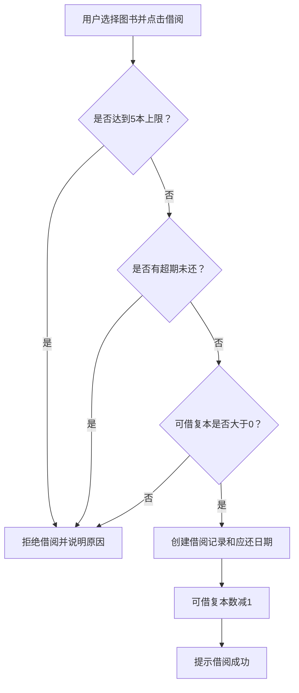
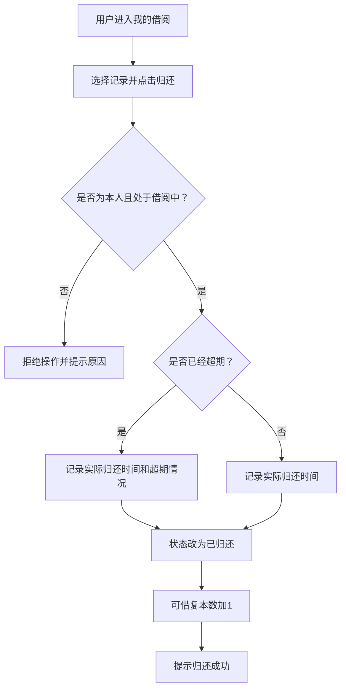
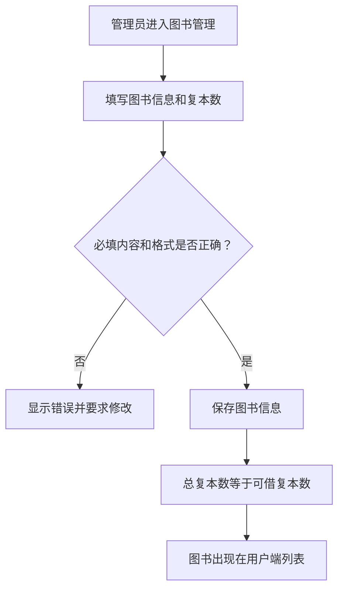

# 校园图书管理系统需求分析说明书

> 学生简版  
> 本文档主要说明系统“要解决什么问题、为谁服务、需要实现哪些功能”。需求分析阶段重点写“做什么”，暂时不展开 Servlet、数据库表结构和代码实现。

## 1. 项目概述

### 1.1 项目背景

目前校园图书借阅涉及图书查询、借书、还书、借阅记录管理等工作。如果主要依靠人工登记，不仅查询效率低，还容易出现库存数量不准确、借阅记录遗漏和超期情况不清楚等问题。

校园图书管理系统面向学校师生和图书管理员，使用浏览器即可完成图书查询、借阅、归还和后台管理，提高图书借阅与管理效率。

### 1.2 项目目标

系统需要达到以下目标：

- 师生能够方便地查询图书，了解图书是否可以借阅。
- 师生能够在线完成借书、还书和借阅记录查询。
- 管理员能够统一管理图书、用户和借阅记录。
- 系统能够自动处理借阅期限、借阅上限和超期限制等规则。
- 系统能够区分普通用户和管理员，防止越权操作。

### 1.3 系统范围

本项目包含：

- 用户注册、登录、退出和个人信息管理。
- 图书浏览、搜索、分类筛选和详情查看。
- 图书借阅、归还、当前借阅和历史借阅查询。
- 管理员对图书、用户和借阅记录的管理。
- 图书多复本管理、超期判断和权限控制。

本项目暂不包含：

- 图书预约、排队和续借。
- 逾期罚款及在线支付。
- RFID、自助借还机等硬件设备。
- 不同学校之间的图书共享。

## 2. 用户角色

| 用户角色 | 角色说明 | 主要操作 |
|---|---|---|
| 未登录用户 | 尚未登录系统的访问者 | 注册、登录 |
| 普通用户 | 已注册的学生或教师 | 查询图书、借书、还书、查看借阅记录、维护个人信息 |
| 管理员 | 负责维护系统数据的管理人员 | 管理图书、用户和全部借阅记录 |

普通用户不能进入管理员页面，管理员的重要操作也必须经过身份和权限检查。

## 3. 功能需求

### 3.1 用户注册与登录

系统应提供以下功能：

- 用户使用学号或工号、姓名、密码和邮箱进行注册。
- 学号或工号不能重复。
- 系统根据学号或工号格式识别学生或教师身份。
- 用户可以使用账号和密码登录系统。
- 登录成功后，普通用户进入用户首页，管理员进入管理后台。
- 用户可以退出登录。
- 用户可以查看个人信息、修改邮箱和修改密码。

### 3.2 图书浏览与查询

普通用户登录后可以浏览系统中的图书，系统应支持：

- 以列表形式显示图书封面、书名、作者、出版社、分类和简介。
- 按书名、作者或 ISBN 进行模糊搜索。
- 按图书分类进行筛选。
- 查看图书详情。
- 显示图书总复本数和当前可借复本数。
- 当可借复本数为 0 时，明确显示“暂无可借”。

### 3.3 图书借阅与归还

普通用户可以完成以下操作：

- 在图书详情页借阅图书。
- 查看当前正在借阅的图书。
- 查看借阅日期和应还日期。
- 归还自己正在借阅的图书。
- 查看已经归还的历史借阅记录。
- 查看图书是否超期及超期天数。

借阅成功后，系统应生成一条借阅记录，并将图书可借复本数减 1。归还成功后，系统应更新归还时间和借阅状态，并将可借复本数加 1。

### 3.4 管理员图书管理

管理员可以：

- 查看和搜索全部图书。
- 新增图书，包括书名、作者、出版社、ISBN、分类、简介、封面和复本数。
- 修改已有图书的基本信息。
- 删除当前无人借阅的图书。
- 查看每种图书的总复本数和可借复本数。

为避免借阅数量混乱，已有借阅记录的图书不能随意修改复本数量；仍有复本借出的图书不能删除。

### 3.5 管理员用户管理

管理员可以：

- 查看全部注册用户。
- 按学号、工号或姓名搜索用户。
- 查看用户类型、邮箱和注册时间。
- 删除符合条件的普通用户。

管理员账号不能被删除；存在未归还图书的用户不能被删除。

### 3.6 管理员借阅管理

管理员可以：

- 查看所有用户的借阅记录。
- 按学号、姓名、书名和借阅状态查询记录。
- 查看借阅日期、应还日期、归还日期和当前状态。
- 单独查看超期未还记录及超期天数。
- 在特殊情况下代替用户完成归还操作。

### 3.7 管理后台首页

管理后台首页可以显示简单的统计信息，例如：

- 图书种类数量。
- 图书总复本数量。
- 注册用户数量。
- 当前借阅数量。
- 超期未还数量。

## 4. 核心业务规则

| 规则 | 具体要求 |
|---|---|
| 借阅上限 | 每名用户最多同时借阅 5 本图书 |
| 借阅期限 | 每次借阅期限为 30 天 |
| 库存限制 | 只有可借复本数大于 0 时才能借阅 |
| 超期限制 | 用户存在超期未还记录时，不能继续借阅新书 |
| 归还规则 | 只能归还本人正在借阅且尚未归还的图书 |
| 图书数量 | 借阅成功后可借复本数减 1，归还后加 1 |
| 删除图书 | 仍有复本借出的图书不能删除 |
| 删除用户 | 仍有图书未归还的用户不能删除 |
| 管理员保护 | 管理员账号不能通过用户管理功能删除 |
| 权限控制 | 未登录用户不能访问业务页面，普通用户不能访问管理页面 |

## 5. 核心业务流程

核心业务流程使用流程图展示。阅读流程图时，重点关注每次操作的开始条件、业务判断、数据变化和最终结果。

### 5.1 借阅图书流程

流程说明：

1. 用户登录系统并查询图书。
2. 用户进入图书详情页面，点击“借阅”。
3. 系统依次检查借阅数量、超期记录和图书库存。
4. 任意条件不满足时，系统拒绝借阅并说明原因。
5. 检查通过后，系统创建借阅记录，应还日期为借阅日期后30天。
6. 系统将可借复本数减1，并提示借阅成功。

### 5.2 归还图书流程

流程说明：

1. 用户选择本人正在借阅的记录并点击“归还”。
2. 系统检查记录是否属于当前用户、是否已经归还。
3. 系统判断图书是否超期，并记录实际归还时间。
4. 借阅状态修改为“已归还”，图书可借复本数加1。
5. 系统重新判断用户是否仍有其他超期未还图书，并提示归还结果。

### 5.3 管理员新增图书流程

流程说明：

1. 管理员填写书名、作者、ISBN、分类、简介和复本数等信息。
2. 系统检查必填项、ISBN和复本数是否符合要求。
3. 检查不通过时，系统显示具体错误，管理员修改后重新提交。
4. 检查通过后保存图书，总复本数和可借复本数相同。
5. 新增图书可以在用户端被查询和查看。

## 6. 数据需求

系统主要管理三类数据：

| 数据对象 | 主要内容 |
|---|---|
| 用户 | 学号或工号、姓名、密码、邮箱、角色、用户类型、注册时间 |
| 图书 | 书名、作者、出版社、ISBN、分类、简介、封面、总复本数、可借复本数 |
| 借阅记录 | 用户、图书、借阅日期、应还日期、实际归还日期、借阅状态 |

数据之间的基本关系：

- 一个用户可以产生多条借阅记录。
- 一本图书可以对应多条借阅记录。
- 一条借阅记录只属于一个用户和一本图书。
- 删除或修改数据时，不能破坏现有借阅记录和图书数量。

## 7. 非功能需求

为了保证系统能够正常使用，还应满足以下要求：

- **易用性**：页面结构清楚，按钮名称容易理解，操作成功或失败后有明确提示。
- **安全性**：密码不能明文保存；所有受限页面和写操作都要验证登录状态与角色权限。
- **正确性**：连续点击借阅或归还时，不能产生重复记录或错误库存。
- **性能**：在课程演示数据量下，普通查询和页面操作一般应在 3 秒内返回结果。
- **兼容性**：系统能够在常见的 Chrome、Edge 浏览器中正常使用。
- **数据校验**：学号、工号、邮箱、ISBN、复本数等信息应进行必要的格式和范围检查。
- **可维护性**：功能模块划分清楚，关键业务规则集中处理，错误信息和返回格式保持一致。

## 8. 验收标准

项目完成后，至少应通过以下检查：

- [ ] 用户能够成功注册、登录和退出。
- [ ] 普通用户无法进入管理员页面。
- [ ] 用户能够浏览、搜索、筛选和查看图书详情。
- [ ] 用户能够成功借阅有可借复本的图书。
- [ ] 用户达到 5 本借阅上限时，系统拒绝继续借阅。
- [ ] 用户存在超期未还记录时，系统拒绝继续借阅。
- [ ] 图书无可借复本时，系统不能创建借阅记录。
- [ ] 用户能够归还自己的图书，归还后库存数量正确。
- [ ] 管理员能够新增、修改、查询和删除符合条件的图书。
- [ ] 管理员能够查询用户，并阻止删除仍有借阅的用户。
- [ ] 管理员能够查看全部借阅记录、超期记录并代为归还。
- [ ] 错误操作不会造成重复借阅、重复归还或库存数量异常。

## 9. 给学生的说明

需求分析不是把代码提前写一遍，而是先把系统要完成的事情说明白。阅读本文档后，学生应该能够回答：

1. 系统有哪些用户？
2. 每类用户能做什么？
3. 借书和还书需要遵守哪些规则？
4. 哪些异常情况必须处理？
5. 最后如何判断系统是否完成？

后续进行系统设计、编码和测试时，应始终以本需求分析中的功能、业务规则和验收标准为依据。
